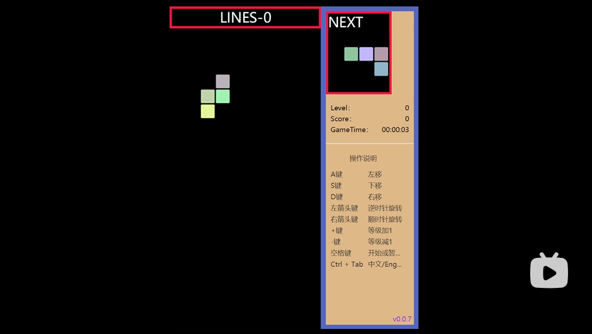
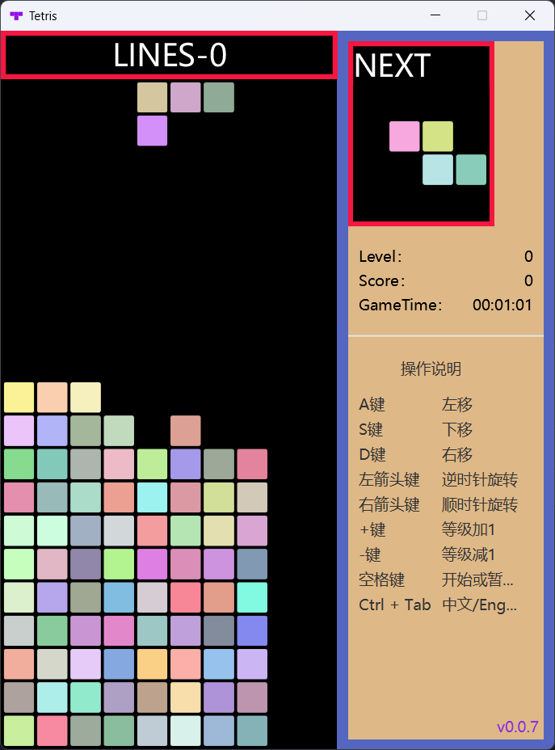

# 俄罗斯方块

> 哔哩哔哩在线视频

[](https://www.bilibili.com/video/BV1Yx4y1S7dK)

> 游戏截图



## 开发环境

- JDK 27
- JavaFX 27
- Maven Wrapper（Maven 3.9.16）

项目使用标准 JVM + JavaFX 运行，不再使用 GraalVM / GluonFX Native Image 打包。

## 运行

Linux / macOS：

```bash
./mvnw javafx:run
```

Windows：

```bat
mvnw.cmd javafx:run
```

## 构建与测试

Linux / macOS：

```bash
./mvnw --batch-mode --no-transfer-progress verify
```

Windows：

```bat
mvnw.cmd --batch-mode --no-transfer-progress verify
```

## 质量检查

格式检查：

```bash
./mvnw spotless:check
```

SpotBugs：

```bash
./mvnw --batch-mode --no-transfer-progress -Pci-quality -DskipTests verify
```

PIT mutation testing：

```bash
./mvnw --batch-mode --no-transfer-progress -Pci-mutation verify
```

GitHub Actions 使用 self-hosted Linux x64 runner 执行构建、SpotBugs、Gitleaks、PIT 和依赖安全检查。

本项目是开源的，不会写入和创建额外业务数据。

## 桌面应用打包

项目使用 JDK 27 自带的 `jpackage` 生成自包含桌面应用，不使用 GraalVM Native Image。原生安装包必须在目标操作系统上构建，不能跨平台生成。

Linux / macOS 默认生成 application image：

```bash
./scripts/package-app.sh
```

Linux 还可以在安装了相应系统打包工具后生成：

```bash
./scripts/package-app.sh deb
./scripts/package-app.sh rpm
```

macOS：

```bash
./scripts/package-app.sh dmg
./scripts/package-app.sh pkg
```

Windows：

```bat
scripts\package-app.cmd
scripts\package-app.cmd exe
scripts\package-app.cmd msi
```

产物位于 `target/jpackage/dist`。GitHub CI 在 Linux self-hosted runner 上验证 `app-image`，Windows/macOS 原生格式应在对应平台构建。

打包脚本显式覆盖 JDK 默认的 jlink options，不执行 `--strip-debug`，因此 Linux 构建不依赖额外安装 `binutils/objcopy`。

## AI 自动玩

游戏运行后按 `F2` 切换 AI 自动玩。默认使用本地 one-ply heuristic agent；它在独立状态快照上枚举合法候选，并根据消行、堆叠高度、空洞和表面起伏评分。

项目还提供 `NextPieceHeuristicTetrisAgent` 作为纯本地 two-ply evaluation baseline：它使用与 Jev 相同的 top-5 当前候选和同一套 deterministic next-piece outlook，但不进行任何远程调用。该策略目前主要用于 benchmark，用来验证收益究竟来自 look-ahead 事实本身，还是来自 Jev 在这些事实之上的选择能力。

项目也支持 TypeSafe AI 的 Jev。`jev` 保留原有 placement-oriented 模式：`BoardSimulator` 生成合法 `PlacementCandidate`，本地 heuristic 只保留前 5 个安全候选，再由 Jev 做二次选择。`jev-action` 则使用 `ActionStateSearch` 先生成真实可达的 `AiPlan`，同样只把 heuristic 排名前 5 的安全候选交给 Jev，因此模型可以利用 `SOFT_DROP`、横移和双向旋转的组合路径，但仍不负责碰撞、旋转、下落或消行规则。两种 Jev 模式都会接收 deterministic next-piece outlook。远程结果只在方块仍保持原 snapshot 坐标时生效；如果下一次自动下落先发生，游戏会在状态变化前废弃远程结果并立即使用本地 heuristic fallback。手动输入会取消该方块尚未完成的远程决策。

远程 Jev 必须显式启用，并通过环境变量提供 API key；默认不会发生远程调用。`TETRIS_AI_AGENT` 当前支持 `heuristic`（默认）、`action`、`jev` 和 `jev-action`。其中 `action` 是完全本地的 deterministic action-native baseline。 `action` 还支持独立的高层目标 `TETRIS_AI_OBJECTIVE`：默认 `survival` 完全保留现有行为；`tuck-hunter` 先把 heuristic top-5 作为 objective 搜索范围，再通过 `ObjectiveSafetyBudget` 相对 SURVIVAL top-1 做风险过滤。当前 conservative budget 不允许新增 holes，并把 aggregate-height / bumpiness 增量各限制为最多 `+4`；只有通过 budget 的当前 tuck 或 next-piece setup 才能改变 SURVIVAL 选择。当前非 survival objective 只支持 `TETRIS_AI_AGENT=action`；其它 agent 会明确拒绝该配置。

Linux / macOS：

```bash
TETRIS_AI_AGENT=jev-action TYPESAFE_API_KEY=<your-key> ./mvnw javafx:run
```

本地 Tuck Hunter：

```bash
TETRIS_AI_AGENT=action \
TETRIS_AI_OBJECTIVE=tuck-hunter \
./mvnw javafx:run
```

Windows CMD：

```bat
set TETRIS_AI_AGENT=jev-action
set TYPESAFE_API_KEY=<your-key>
mvnw.cmd javafx:run
```

API key 不应写入仓库或配置文件。当前 Jev adapter 使用官方 `jev-latest` 模型和 `/v1/systemone` Choice API，对 HTTP 429 / 529 进行有限指数退避重试。

AI 决策不直接操作 JavaFX View；`GameWorld` 接收统一的 `AiPlan` 并按顺序映射到现有游戏动作。placement-oriented agent 会先通过 adapter 转换成 `AiPlan`，action-native agent 则可以直接返回动作序列。方块序列由独立的 7-bag generator 提供，并支持 seed，用于可重复测试和后续 benchmark。

架构说明见 `docs/architecture/ai-engine.md`。

## AI Benchmark

项目提供独立的 headless benchmark，不启动 JavaFX View、动画、音频或实时 gravity。placement-oriented 策略通过 `BoardSimulator` 的合法候选/resulting board 推进游戏；action-native 策略通过 `ActionPlanSimulator` 重放 `AiPlan`，后者继续复用 `ActionStateSearch`、`Tetris` 和 `BoardRules`。benchmark 不建立第二套 Tetris 规则。每个新方块在构造 AI snapshot 前都会先执行一次与 `GameWorld` 相同的初始自动 `downMove()`，保证 benchmark 与桌面运行时从相同坐标边界开始决策。

默认运行 1 局、最多 50 个方块、seed 从 1 开始，使用本地 heuristic：

```bash
./mvnw -Dmain.class=xyz.xuminghai.tetris/xyz.xuminghai.tetris.ai.benchmark.BenchmarkApplication javafx:run
```

可通过环境变量调整：

- `TETRIS_BENCHMARK_AGENT`: `heuristic`（默认）、`lookahead`、`jev`、`action`（deterministic action-native）、`tuck-hunter`、`action-provenance`（纯本地 action-only 分布扫描）或 `jev-action`
- `TETRIS_BENCHMARK_GAMES`: 局数，默认 `1`
- `TETRIS_BENCHMARK_MAX_PIECES`: 每局最多方块数，默认 `50`
- `TETRIS_BENCHMARK_SEED`: 第一局 seed，后续每局递增，默认 `1`
- `TYPESAFE_API_KEY`: `jev` / `jev-action` benchmark 必需

例如使用相同 seed 跑 10 局本地 heuristic：

```bash
TETRIS_BENCHMARK_GAMES=10 \
TETRIS_BENCHMARK_MAX_PIECES=500 \
TETRIS_BENCHMARK_SEED=1000 \
./mvnw -Dmain.class=xyz.xuminghai.tetris/xyz.xuminghai.tetris.ai.benchmark.BenchmarkApplication javafx:run
```

`jev` 与 `jev-action` benchmark 都会真实调用 TypeSafe API，因此会产生网络延迟和 token 使用量。Action-native Jev 可这样运行：

```bash
TETRIS_BENCHMARK_AGENT=jev-action \
TETRIS_BENCHMARK_GAMES=1 \
TETRIS_BENCHMARK_MAX_PIECES=50 \
TETRIS_BENCHMARK_SEED=1000 \
TYPESAFE_API_KEY=<your-key> \
./mvnw -Dmain.class=xyz.xuminghai.tetris/xyz.xuminghai.tetris.ai.benchmark.BenchmarkApplication javafx:run
```

输出包含每局 `pieces / lines / primary failures / fallback count / average and max decision latency`，以及局面健康度 `aggregate height / holes / bumpiness` 的 final / average / max。两种 Jev 模式都会汇总 confidence、token、candidate count、selected heuristic rank、top-1 agreement，以及相对本地 shortlist 第一名的 immediate metric delta。`jev-action` 还会在 shortlist 已经确定之后，按与 reachability benchmark 相同的 post-lock/post-row-clear outcome 口径标记哪些候选是旧 rotate-then-shift placement 路径无法达到的 action-only outcome，并统计候选占比与实际选择率；这个 provenance 只进入 telemetry，不发送给 Jev，也不参与排序。手动 workflow 会把 Jev 逐 decision telemetry 保存为 `jev-decisions.csv`；`tuck-hunter` 还会输出 `tuck-hunter-decisions.csv`，区分“当前直接执行 action-only”与“为 next piece 创建 top-5 action-only setup”，并记录每个 decision 的 safety-eligible / rejected candidate 数量以及最终选择相对 SURVIVAL top-1 的 cleared-lines / height / holes / bumpiness delta。这些 board-health 数值直接来自生产 `PlacementCandidate`；action-native 路径由 `ActionPlanSimulator` 解析后同样落到这套客观 metrics。benchmark latency 是完整 agent 调用耗时，不模拟桌面游戏的实时 gravity deadline。

也可以从 GitHub Actions 手动运行 **AI Benchmark** workflow。默认参数为 `heuristic / 20 games / 500 max pieces / seed 1000`，结果会以 artifact 保存 30 天，其中包含逐局 CSV、summary、运行元数据和原始日志。`compare` 使用同一组 seed 运行 `heuristic / lookahead / jev`；`compare-action` 运行 `action / jev-action`；`compare-objective` 完全本地运行 `action / tuck-hunter`，用于测量主动制造 tuck 机会的收益和生存代价；`action-provenance` 则完全本地运行 deterministic action baseline，并对每个真实决策状态统计 `total_action_candidates / total_action_only_candidates / best_action_only_rank / top5_action_only_candidates`。其 aggregate summary 会给出出现 action-only outcome 的状态占比、总体候选占比、action-only 最佳平均 rank，以及进入 top-5 的状态占比；逐 decision 数据保存到 `action-provenance.csv`。该模式不调用 Jev，也不需要 `confirm_jev_cost`。

Jev workflow 不会自动执行。选择 `jev`、`jev-action`、`compare` 或 `compare-action` 时必须同时：

1. 在 repository Actions secrets 中配置 `TYPESAFE_API_KEY`；
2. 显式勾选 `confirm_jev_cost`；
3. 保持单次潜在 decision 数 `games × max_pieces <= 200`。

这个限制用于避免误触发大量外部模型调用；普通 CI、push、PR 和定时质量检查都不会运行真实 Jev benchmark。
