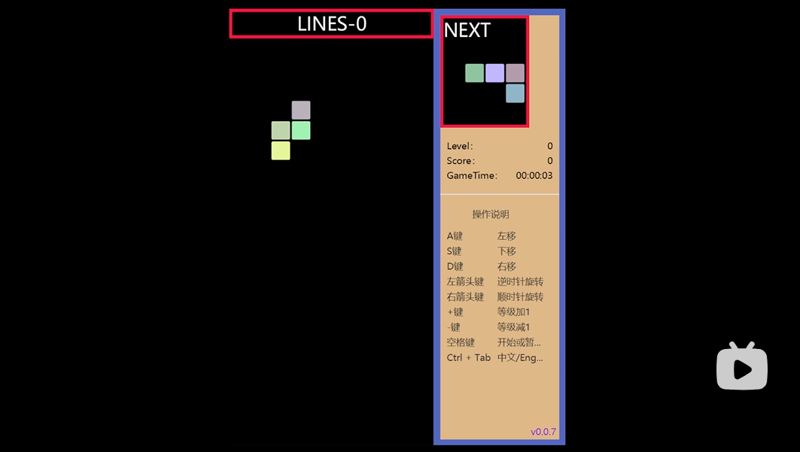
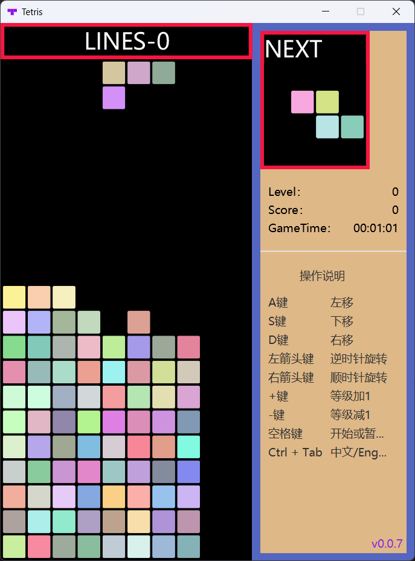

# 俄罗斯方块

> 哔哩哔哩在线视频

[](https://www.bilibili.com/video/BV1Yx4y1S7dK)

> 历史游戏截图（UI V1 改版前）



## 开发环境

当前运行界面已采用 UI V1 三栏布局。设计预览、视觉规范及与生产行为的差异见 [UI V1：棋盘 + AI 驾驶舱](docs/design/ui-v1/README.md)。

- JDK 27
- JavaFX 27
- Maven Wrapper（Maven 3.9.16）

项目使用标准 JVM + JavaFX 运行，不再使用 GraalVM / GluonFX Native Image 打包。

## 运行

Linux / macOS：

```bash
./mvnw javafx:run
```

Windows：

```bat
mvnw.cmd javafx:run
```

## 构建与测试

Linux / macOS：

```bash
./mvnw --batch-mode --no-transfer-progress verify
```

Windows：

```bat
mvnw.cmd --batch-mode --no-transfer-progress verify
```

## 质量检查

格式检查：

```bash
./mvnw spotless:check
```

SpotBugs：

```bash
./mvnw --batch-mode --no-transfer-progress -Pci-quality -DskipTests verify
```

PIT mutation testing：

```bash
./mvnw --batch-mode --no-transfer-progress -Pci-mutation verify
```

PIT 仅评估 `core` 包及其测试，mutation score 与 mutated-class line coverage 均要求至少 95%。
当前基线、存活变异分类和验证边界见 [核心变异测试说明](docs/testing/core-mutation.md)。

GitHub Actions 使用 self-hosted Linux x64 runner 执行构建、SpotBugs、Gitleaks、PIT 和依赖安全检查。

本项目是开源的，不会写入和创建额外业务数据。

## 桌面应用打包

项目使用 JDK 27 自带的 `jpackage` 生成自包含桌面应用，不使用 GraalVM Native Image。原生安装包必须在目标操作系统上构建，不能跨平台生成。

Linux / macOS 默认生成 application image：

```bash
./scripts/package-app.sh
```

Linux 还可以在安装了相应系统打包工具后生成：

```bash
./scripts/package-app.sh deb
./scripts/package-app.sh rpm
```

macOS：

```bash
./scripts/package-app.sh dmg
./scripts/package-app.sh pkg
```

Windows：

```bat
scripts\package-app.cmd
scripts\package-app.cmd exe
scripts\package-app.cmd msi
```

产物位于 `target/jpackage/dist`。GitHub CI 在 Linux self-hosted runner 上验证 `app-image`，Windows/macOS 原生格式应在对应平台构建。

打包脚本显式覆盖 JDK 默认的 jlink options，不执行 `--strip-debug`，因此 Linux 构建不依赖额外安装 `binutils/objcopy`。

## AI 自动玩

游戏运行后按 `F2` 切换 AI 自动玩。默认使用本地 one-ply heuristic agent；它在独立状态快照上枚举合法候选，并根据消行、堆叠高度、空洞和表面起伏评分。

项目还提供 `NextPieceHeuristicTetrisAgent` 作为纯本地 two-ply evaluation baseline：它使用与 Jev 相同的 top-5 当前候选和同一套 deterministic next-piece outlook，但不进行任何远程调用。该策略目前主要用于 benchmark，用来验证收益究竟来自 look-ahead 事实本身，还是来自 Jev 在这些事实之上的选择能力。

项目也支持 TypeSafe AI 的 Jev。`jev` 保留原有 placement-oriented 模式：`BoardSimulator` 生成合法 `PlacementCandidate`，本地 heuristic 只保留前 5 个安全候选，再由 Jev 做二次选择。`jev-action` 则使用 `ActionStateSearch` 先生成真实可达的 `AiPlan`，同样只把 heuristic 排名前 5 的安全候选交给 Jev，因此模型可以利用 `SOFT_DROP`、横移和双向旋转的组合路径，但仍不负责碰撞、旋转、下落或消行规则。两种 Jev 模式都会接收 deterministic next-piece outlook。远程结果只在方块仍保持原 snapshot 坐标时生效；如果下一次自动下落先发生，游戏会在状态变化前废弃远程结果并立即使用本地 heuristic fallback。手动输入会取消该方块尚未完成的远程决策。

远程 Jev 必须显式启用，并通过环境变量提供 API key；默认不会发生远程调用。`TETRIS_AI_AGENT` 当前支持 `heuristic`（默认）、`action`、`jev` 和 `jev-action`。其中 `action` 是完全本地的 deterministic action-native baseline。`action` 还支持独立的高层目标 `TETRIS_AI_OBJECTIVE`：`survival`（默认）完全保留现有行为；`tuck-hunter` 用于寻找/创造 action-only 机会；`build-shape` 则在同一 deterministic reachability + Risk Controller 边界内，持续让 resulting board 接近内置 Tetris-aware target。健康状态使用 `BALANCED (holes +0 / height +8 / bumpiness +8)`，普通状态使用 `CONSERVATIVE (0 / +4 / +4)`，高堆叠或 holes 较多时降为 `STRICT (0 / +0 / +2)`；`RISKY (holes +1)` 仍只用于 benchmark calibration，不会被 runtime controller 选择。当前非 survival objective 只支持 `TETRIS_AI_AGENT=action`；其它 agent 会明确拒绝该配置。

Linux / macOS：

```bash
TETRIS_AI_AGENT=jev-action TYPESAFE_API_KEY=<your-key> ./mvnw javafx:run
```

本地 Tuck Hunter：

```bash
TETRIS_AI_AGENT=action \
TETRIS_AI_OBJECTIVE=tuck-hunter \
./mvnw javafx:run
```

本地 BUILD_SHAPE（底部居中的 Tetris-aware `HEART`）：

```bash
TETRIS_AI_AGENT=action \
TETRIS_AI_OBJECTIVE=build-shape \
./mvnw javafx:run
```

仅为 BUILD_SHAPE 显式开启已知 preview 的即时救援（默认关闭）：

```bash
TETRIS_AI_AGENT=action \
TETRIS_AI_OBJECTIVE=build-shape \
TETRIS_AI_PREVIEW_RESCUE=true \
./mvnw javafx:run
```

若普通 BUILD_SHAPE 选中 SURVIVAL rank 1，但该动作使已知下一块无可见落点，AI 会按现有 SURVIVAL 顺序选择第一个能让下一块落下的替代动作；没有替代动作时保留原决策。后续决策仍从普通 BUILD_SHAPE 开始。配置仅接受 `true` / `false`，且仅适用于 `action + build-shape`。桌面继续通过异步 AI 执行器的 snapshot 校验和自动下落前 fallback 处理超时；headless 基准的延迟不能代替真实 JavaFX 时序验证。

桌面实测可额外设置 `TETRIS_AI_DECISION_TRACE=true`。控制台每个请求输出一行 `AI_DECISION`：`callback` 表示 JavaFX 回调在重力前接收计划并开始逐步播放，`gravity-ready` 表示结果在 tick 到来时已完成，`gravity-fallback` 表示 tick 到来时主决策仍未完成并使用本地回退；`cancelled` / `failed` / `fallback-failed` 也会记录。这些 outcome 表示计划被接收或回退，不保证整串动作最终完成。`elapsed_ms` 从提交到 JavaFX 处理或重力 tick，`fx_queue_ms` 在回调处理（含回调失败）时可用，其他路径为 `-1`，`fallback_ms` 是 tick 上同步回退的计算耗时。默认关闭；打印本身会影响 JavaFX 线程时序，观察值不能直接当作无诊断开销下的性能保证。

将开启诊断的一次桌面运行输出保存为日志后，可用 `python3 scripts/analyze_ai_decision_trace.py ai-decision.log` 汇总各 outcome 数量、有效应用中的重力回退比例，以及完成时间、JavaFX 回调排队和同步回退耗时的 nearest-rank P95 / 最大值。Windows 可用 `py -3 scripts\analyze_ai_decision_trace.py ai-decision.log`。脚本忽略其他控制台行，遇到损坏的 `AI_DECISION` 行或没有诊断数据会报错。取消与失败单独计数，不进入回退比例分母。普通桌面入口仍使用随机序列；专用采集入口使用固定 seed，并在摘要中报告。相同 seed 只保证方块序列相同，JavaFX 调度、重力竞争和采集结束位置仍可能不同，不能将单次日志差异直接解释为策略收益。

Windows CMD 的一次采集示例（关闭游戏后再汇总）：

```bat
set TETRIS_AI_AGENT=action
set TETRIS_AI_OBJECTIVE=build-shape
set TETRIS_AI_PREVIEW_RESCUE=true
set TETRIS_AI_DECISION_TRACE=true
mvnw.cmd javafx:run > "%TEMP%\tetris-ai-decision.log" 2>&1
py -3 scripts\analyze_ai_decision_trace.py "%TEMP%\tetris-ai-decision.log"
```

同仓库 PR 修改生产 AI、游戏规则或 JavaFX 视图等相关路径时，GitHub Actions 的 **Desktop AI Timing** 会自动采集 120 秒，摘要写入 Actions 运行摘要，原始日志与汇总文件作为 artifact 保存 7 天；新提交会取消该 PR 上旧的采集任务。自动 PR 采集固定 7-bag seed `1000`；手动运行可指定 1–900 秒及 signed 64-bit `seed`。工作流使用 JavaFX 的 headless 平台和生产 `GameWorld` / `DashboardView`，仅采集入口关闭音频，固定开启 BUILD_SHAPE 的 preview rescue。这只代表 self-hosted Linux runner 的 JavaFX 时钟和软件渲染环境，不能替代 Windows 桌面上的交互、音频或最终重力期限验证；较短的样本也未必遇到 preview 救援条件。

专用 `DesktopAiTimingApplication` 使用 `TETRIS_AI_TRACE_SEED`（默认 `1000`）创建独立的 `BagPieceGenerator`，通过 `GameWorld` 构造器注入。日志 `AI_TRACE_SESSION seconds=… seed=…` 和 Actions 摘要均保留实际 seed；旧日志缺失 seed 时显示 `unavailable`，损坏或拼接多个 session 的日志会报错。Windows 可设置 `TETRIS_AI_TRACE_SEED=1000`、`TETRIS_AI_TRACE_SECONDS=120`，并用 `mvnw.cmd -Dmain.class=xyz.xuminghai.tetris/xyz.xuminghai.tetris.DesktopAiTimingApplication javafx:run` 启动自动限时采集（同时保留上述 AI 与诊断环境变量）。该 seed 只影响专用采集入口，普通游戏继续随机生成方块。

采集入口还会输出 `AI_PREVIEW_RESCUE`，汇总 rank-1 检查、已知下一块不可恢复、找到替代动作的次数，以及检查和搜索耗时。这些是 AI 工作线程**算出的计划**；被重力 tick 废弃或取消的计划也可能计入，不能用它代替 `AI_DECISION` 的实际应用结果。旧日志没有此行时汇总显示 `unavailable`，不推断为零次救援。

开启 `TETRIS_AI_DECISION_TRACE=true` 后，逐步播放的 AI 计划结束时还会输出 `AI_PLAYBACK`：`completed` 表示动作执行完毕；`gravity-landed` 表示重力先使方块触底、剩余只有下落动作，直接走正常锁定；`blocked` 表示仍需其他动作但某步已不可执行、需重新决策；`piece-changed`、`manual`、`paused`、`ai-off`、`superseded` 分别标明其他打断原因。每条包含播放耗时、计划/已执行控制数和 AI 成功执行的下落格数（软下落与逐格硬下落，不含自然重力）。摘要的完成比例将前两种视为完成，只以**已记录终态的播放**为分母；采集结束时仍在进行的计划不计入，重力 tick 内同步执行的回退没有逐步播放记录。软下落每格间隔 20 毫秒，横移和旋转间隔 45 毫秒；最后一个软下落后若仅剩终结 `HARD_DROP`，立即执行终结动作并沿正常路径锁定，避免空等下一间隔。旧日志没有 `AI_PLAYBACK` 行时显示 `unavailable`。

受阻时还会输出 `AI_PLAYBACK_BLOCKED`，记录失效动作、方块类型、计划索引、动作序列和当前方块坐标，用于区分重力竞争与重复的非法控制路径。
汇总脚本忽略该受阻诊断行，但遇到格式损坏的 `AI_PLAYBACK` 终态行会报错，避免静默低估完成率分母。

方块尚在棋盘上方时，旋转可能暂时让四格全部不可见；只要按共享棋盘规则仍可放置，游戏会接受该操作并保留旋转状态，不要求当前帧必须有可见格。碰撞导致旋转失败时会同时恢复方块坐标和方向。

`BUILD_SHAPE` 当前只支持 fixed HEART occupancy 的单步 greedy 构造：`#` 为 REQUIRED，`.` 为 FORBIDDEN，`+` 为 SUPPORT_ALLOWED。clean completion 要求 REQUIRED 全部占用且 FORBIDDEN 全空。常规 planner 保留 SURVIVAL top-5、Risk Controller 和相对 top-1 的 Safety Budget，DANGER 时停止 creative deviation。颜色目标、自定义图案与 Jev 指令创作尚未实现。

当前策略、已完成实验、否决理由及后续验收维度见 [AI 研究索引](docs/research/README.md)；逐轮数据见 [详细研究记录](docs/research/ai-experiment-history.md)。这些研究结果不代表稳定 HEART 构造能力或 Windows 实时保证。

Windows CMD：

```bat
set TETRIS_AI_AGENT=jev-action
set TYPESAFE_API_KEY=<your-key>
mvnw.cmd javafx:run
```

API key 不应写入仓库或配置文件。当前 Jev adapter 使用官方 `jev-latest` 模型和 `/v1/systemone` Choice API，对 HTTP 429 / 529 进行有限指数退避重试。

AI 决策不直接操作 JavaFX View；`GameWorld` 接收统一的 `AiPlan`。人工键盘和 AI 都使用 `GameWorld` 的同一组移动、旋转、下落方法；输入来源只区分人工输入优先和音效，AI 不模拟键盘按住/连发。在重力前完成的普通回调会在 JavaFX 线程上逐步执行这些动作：横移和旋转间隔约 45 ms，快速下落按约 20 ms/格显示，到底后立即经正常游戏流程锁定。重力仍正常推进，若导致某个动作失效则从当前方块重新决策；玩家输入、暂停或关闭 AI 会取消尚未执行的动作。仅当决策直到重力 tick 才完成或需要本地回退时，仍在 tick 内同步执行全套动作，保证既有的 deadline 语义。placement-oriented agent 会先通过 adapter 转换成 `AiPlan`，action-native agent 则可以直接返回动作序列。方块序列由独立的 7-bag generator 提供，并支持 seed，用于可重复测试和后续 benchmark。

架构说明见 `docs/architecture/ai-engine.md`。

## AI Benchmark

项目提供独立的 headless benchmark，不启动 JavaFX View、动画、音频或实时 gravity。placement-oriented 策略通过 `BoardSimulator` 的合法候选/resulting board 推进游戏；action-native 策略通过 `ActionPlanSimulator` 重放 `AiPlan`，后者继续复用 `ActionStateSearch`、`Tetris` 和 `BoardRules`。benchmark 不建立第二套 Tetris 规则。每个新方块在构造 AI snapshot 前都会先执行一次与 `GameWorld` 相同的初始自动 `downMove()`，保证 benchmark 与桌面运行时从相同坐标边界开始决策。

默认运行 1 局、最多 50 个方块、seed 从 1 开始，使用本地 heuristic：

```bash
./mvnw -Dmain.class=xyz.xuminghai.tetris/xyz.xuminghai.tetris.ai.benchmark.BenchmarkApplication javafx:run
```

可通过环境变量调整：

- `TETRIS_BENCHMARK_AGENT`: `heuristic`（默认）、`lookahead`、`jev`、`action`（deterministic action-native）、`tuck-hunter`（固定 risk profile）、`adaptive-tuck-hunter`、`build-shape`、`build-shape-preview`（benchmark-only 一步 preview lookahead）、`action-provenance`（纯本地 action-only 分布扫描）或 `jev-action`
- `TETRIS_BENCHMARK_GAMES`: 局数，默认 `1`
- `TETRIS_BENCHMARK_MAX_PIECES`: 每局最多方块数，默认 `50`
- `TETRIS_BENCHMARK_SEED`: 第一局 seed，后续每局递增，默认 `1`
- `TETRIS_BENCHMARK_RISK_PROFILE`: `strict` / `conservative`（默认）/ `balanced` / `risky`，仅影响 `tuck-hunter` benchmark
- `TYPESAFE_API_KEY`: `jev` / `jev-action` benchmark 必需

BUILD_SHAPE 还提供独立的 construction feasibility 入口。它不是 gameplay agent，不读取 `TETRIS_BENCHMARK_AGENT`；给定 seeded 7-bag 序列后，用真实 `ActionStateSearch -> PlacementCandidate -> BoardRules` 扩展可达棋盘，并用 bounded beam 保留搜索前沿：

```bash
TETRIS_BENCHMARK_GAMES=20 \
TETRIS_BENCHMARK_MAX_PIECES=24 \
TETRIS_BENCHMARK_SEED=1000 \
TETRIS_BENCHMARK_FEASIBILITY_BEAM_WIDTH=128 \
./mvnw -Dmain.class=xyz.xuminghai.tetris/xyz.xuminghai.tetris.ai.benchmark.ShapeFeasibilityApplication javafx:run
```

该模式若找到 clean completion，会输出逐 piece 的 `AiPlan` witness，并立即运行 runtime constraint audit 与 construction safety envelope；未找到只表示当前 depth / beam 预算没有找到构造路径。constraint audit 写入 `shape-witness-audit.csv`；成功路径的绝对 board-health 与 immediate continuation facts 写入 `construction-safety-envelope.csv`；同 future piece sequence 下的 witness-vs-SURVIVAL viability calibration 写入 `construction-viability.csv`。envelope extrema、greedy horizon 和 bounded-search horizon 都是 observed evidence，不应直接复制成新的安全阈值。

例如使用相同 seed 跑 10 局本地 heuristic：

```bash
TETRIS_BENCHMARK_GAMES=10 \
TETRIS_BENCHMARK_MAX_PIECES=500 \
TETRIS_BENCHMARK_SEED=1000 \
./mvnw -Dmain.class=xyz.xuminghai.tetris/xyz.xuminghai.tetris.ai.benchmark.BenchmarkApplication javafx:run
```

`jev` 与 `jev-action` benchmark 都会真实调用 TypeSafe API，因此会产生网络延迟和 token 使用量。Action-native Jev 可这样运行：

```bash
TETRIS_BENCHMARK_AGENT=jev-action \
TETRIS_BENCHMARK_GAMES=1 \
TETRIS_BENCHMARK_MAX_PIECES=50 \
TETRIS_BENCHMARK_SEED=1000 \
TYPESAFE_API_KEY=<your-key> \
./mvnw -Dmain.class=xyz.xuminghai.tetris/xyz.xuminghai.tetris.ai.benchmark.BenchmarkApplication javafx:run
```

输出包含每局 `pieces / lines / primary failures / fallback count / average and max decision latency`，以及局面健康度 `aggregate height / holes / bumpiness` 的 final / average / max。两种 Jev 模式都会汇总 confidence、token、candidate count、selected heuristic rank、top-1 agreement，以及相对本地 shortlist 第一名的 immediate metric delta。`jev-action` 还会在 shortlist 已经确定之后，按与 reachability benchmark 相同的 post-lock/post-row-clear outcome 口径标记哪些候选是旧 rotate-then-shift placement 路径无法达到的 action-only outcome，并统计候选占比与实际选择率；这个 provenance 只进入 telemetry，不发送给 Jev，也不参与排序。BUILD_SHAPE 除逐 decision telemetry 外，还输出逐局 `best_visual_error / max_required_with_zero_forbidden / min_forbidden_at_full_required / clean_completion`，aggregate summary 会统计 `games_error_le_8 / <=4 / ==0`，避免跨所有 decision 的平均 visual error 掩盖最佳构造状态。`compare-shape-guard` 额外用相同 seed 比较当前 runtime BUILD_SHAPE 与三档 benchmark-only construction guard，并输出 guard checked/rejected、selected survival rank、baseline/selected preview reachable outcomes 和 selected headroom。首轮 10×250 已证明 one-piece continuation capacity 不能单独承担 runtime safety，因此该模式主要保留用于复现和后续 guard 迭代。手动 workflow 会把这些数据分别保存为 artifact CSV。benchmark latency 是完整 agent 调用耗时，不模拟桌面游戏的实时 gravity deadline。

GitHub Actions 对同仓库、目标为当前 default branch 的 PR 自动选择最多一个相关 deterministic benchmark；新 revision 取消旧 run，外部 fork 和 Jev 不进入自动路径。选择顺序与固定参数以 [PR selector](.github/workflows/ai-benchmark-pr.yml) 为准，复现入口见 [实验索引](docs/research/README.md)。

可从 GitHub Actions 手动运行 [AI Benchmark](.github/workflows/ai-benchmark.yml)。普通 gameplay 默认 `20 games / 500 max pieces / seed 1000`，artifact 保留 30 天。常用模式包括 `compare-objective`、`compare-adaptive`、`compare-shape`、`shape-feasibility` 和 `preview-rescue-paired`；完整实验协议、入口与结论见 [研究索引](docs/research/README.md)。feasibility 使用独立 depth/beam 参数，不能把普通 gameplay 的 500-piece limit 当搜索深度。

Jev workflow 不会自动执行。选择 `jev`、`jev-action`、`compare` 或 `compare-action` 时必须同时：

1. 在 repository Actions secrets 中配置 `TYPESAFE_API_KEY`；
2. 显式勾选 `confirm_jev_cost`；
3. 保持单次潜在 decision 数 `games × max_pieces <= 200`。

这个限制用于避免误触发大量外部模型调用；普通 CI、push、PR 和定时质量检查都不会运行真实 Jev benchmark。
